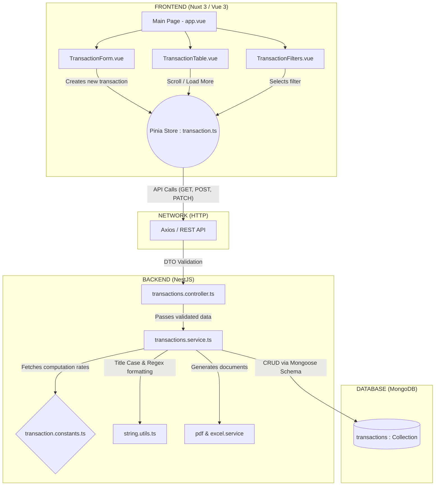

# System Design & Architecture - Estate Finance

This document provides an in-depth look into the architectural decisions, design patterns, and engineering philosophies behind the **Estate Finance - Transaction Management System**.

---

## 1. High-Level Architecture Overview
This diagram serves as the structural backbone of the Estate Finance system, highlighting the decoupled nature of the client and server.

The system is built on a decoupled **Client-Server architecture**. This separation of concerns ensures that the user interface (Frontend) and the business logic/data processing (Backend) evolve independently, providing maximum scalability and maintainability.

- **Client (Frontend):** A Single Page Application (SPA) built with Nuxt 3, handling state, UI rendering, and user interactions.
- **API (Backend):** A RESTful API built with NestJS, serving data, enforcing business rules, generating reports (PDFs, Excel), and orchestrating the database.
- **Database Layer:** MongoDB Atlas (NoSQL) accessed via Mongoose ODM.

---

## 2. Core Technologies

### Backend
- **Node.js & NestJS:** Chosen for its heavily opinionated, Angular-like modular architecture. It enforces strong typing (TypeScript), dependency injection, and clean module separation.
- **MongoDB & Mongoose:** A NoSQL database provides the flexibility to embed complex objects (like the financial breakdown) directly into the transaction document. Enhanced via **MongoDB `$text` Search Indexes** for high-performance string matching instead of expensive table scans.
- **Swagger (OpenAPI):** Integrated via `@nestjs/swagger` for automated API documentation and contract testing.

### Frontend
- **Vue 3 & Nuxt 3:** Chosen for its performance, Composition API, and developer experience.
- **Pinia:** The default Vue 3 state management library, providing a type-safe, centralized store for transactions and notifications.
- **Tailwind CSS:** A utility-first CSS framework enabling rapid UI development without the bloat of traditional CSS files.

---

## 3. Data Modeling & Database Architecture

### The Transaction Schema
A central thesis of this system is the **Transaction** document. Since real estate deals involve complex and sensitive financial data, consistency is critical.

The Embedded Financial Breakdown Pattern was utilized.

#### Why Embed Financial Calculations?
Commission policies (like 50% / 50% split) can change over time. If a policy changes in 2026, transactions from 2025 must remain untouched. By calculating the commission *at the time of creation/mutation* and embedding the exact numerical breakdown directly inside the Transaction document, we create an immutable **Audit Log**.

**Core Schema Fields:**
- `propertyAddress` (String)
- `totalServiceFee` (Number)
- `listingAgent` (String)
- `sellingAgent` (String) - *Optional, indicating a split deal*
- `status` (Enum: `agreement` | `earnest_money` | `title_deed` | `completed`)
- `financialBreakdown` (Object)
    - `agencyShare` (Number)
    - `agentPortion` (Number)
    - `listingAgentShare` (Number)
    - `sellingAgentShare` (Number)

---

## 4. System Workflows & Financial Rules

### 4.1 Transaction Lifecycle Flow
Transactions follow a strict sequential, non-reversible lifecycle:
`Agreement` ➔ `Earnest Money` ➔ `Title Deed` ➔ `Completed`

- **Rules Enforcement:** The backend enforces these transitions via guards. A user cannot jump from `Agreement` directly to `Completed` without passing the intermediate stages.
- **True Immutability:** Once an item's status reaches `Completed`, the process completely halts. Further patches, edits, or stage changes are forbidden (`400 Bad Request`) to honor final financial tracking parameters.
- **Endpoints:** Handled via a specific `transition` endpoint (`POST /transactions/:id/transition`) rather than generic updates, ensuring precise state machine logic.

### 4.2 Commission Logic (The 50/50 Rule)
Whenever a transaction is created or its fee is updated, the server recalculates the `financialBreakdown`:
1. **Agency Share:** Always 50% of `totalServiceFee`.
2. **Agent Portion:** The remaining 50%.
3. **Agent Distribution:**
   - *Single Agent Scenario:* The listing agent receives 100% of the Agent Portion.
   - *Co-Agent Scenario:* If a `sellingAgent` exists, the Agent Portion is split 50/50 (i.e., 25% of the total fee each).

---

## 5. Backend Architecture (NestJS)

### 5.1 Modules and Layers
The backend follows the standard NestJS layered architecture:
- **Controllers:** Handle incoming HTTP requests, route parameters, and interact with DTOs.
- **Services:** Contain the core business logic (commission splitting, database queries, PDF generation).
- **Repositories (Mongoose Models):** Handle direct database interactions.

### 5.2 Validation & Error Handling
- **DTOs & Class-Validator:** Every incoming payload is validated against a Data Transfer Object (DTO). If a required field is missing or the wrong type, the framework automatically rejects it with a `400 Bad Request`.
- **Global Exception Filter:** All unhandled errors are caught by a global filter, normalizing the error response sent to the frontend.

### 5.3 Export Generation
- **ExcelJS:** For generating large datasets into `.xlsx` formats dynamically.
- **PDFKit:** Used to generate precise, read-only settlement reports on demand.

---

## 6. Frontend Architecture (Nuxt 3)

### 6.1 Component Strategy
We avoided "God Components" by splitting the UI into specialized, modular components:
- `TransactionForm.vue`: Handles creation and updating (handles form state, validation UI).
- `TransactionFilters.vue`: Emits search queries and status filters.
- `TransactionTable.vue`: Renders data, handles the infinite scroll listener, and visualizes the stepper.
- `AppNotifications.vue`: A global toast notification overlay.

### 6.2 Environment & API Configuration
The frontend leverages Nuxt 3's `RuntimeConfig` to separate hardcoded values from logic. The `NUXT_PUBLIC_API_BASE` environment variable dictates the backend URL, ensuring seamless migration between local development and production deployments.

### 6.3 Native Features & Backend-Driven Pagination
- **Server-Side Pagination & Sorting:** Sorting functionality avoids flawed memory representations by delegating all chronological filters safely over API query parameters directly attached to the MongoDB limits.
- **Semantic DOM & Autocomplete:** Leverages pure native HTML `<datalist>` populated directly from the backend endpoint (`GET /transactions/agents`) to provide real-time suggestions based on prior historical names — no heavy third-party dropdown plugins required. 
- **Infinite Scrolling:** As the user scrolls `IntersectionObserver` triggers the Pinia store to fetch `page=2`, appending the new data safely below.

---

## 7. State Management (Pinia)

State is managed by two primary Pinia stores:
1. **Transaction Store (`stores/transaction.ts`):** 
   - Maintains the `transactions` array.
   - Handles async actions (`fetchTransactions`, `createTransaction`, `transitionStage`).
   - Manages pagination metadata (`page`, `hasMore`).
2. **Notification Store (`stores/notification.ts`):**
   - Simple list of toast messages (Success, Error, Info).
   - Self-clearing mechanism after a timeout.

---

## 8. Design Patterns & Best Practices

- **Single Source of Truth:** The backend database is the ultimate authority. The frontend acts merely as a visual interpretation of this truth.
- **Fail Fast:** Backend validations ensure bad data is caught at the network edge before any compute is wasted.
- **Optimistic UI (Optional/Planned):** Currently, UI updates after server confirmation to ensure 100% data integrity, particularly vital for financial apps.

---

## 9. Future Scalability Considerations

- **Caching Layer:** As the app grows, implementing Redis to cache frequently accessed, read-heavy data (like completed transactions) can reduce MongoDB load.
- **Microservices:** If the reporting logic (PDF/Excel generation) becomes CPU intensive, it can easily be decoupled from the core NestJS monolith into an event-driven microservice using RabbitMQ or Kafka.
- **Role-Based Access Control (RBAC):** Expanding the User schema to include `Admin` and `Agent` roles, ensuring agents can only see their own deals via JWT-based auth guards.
