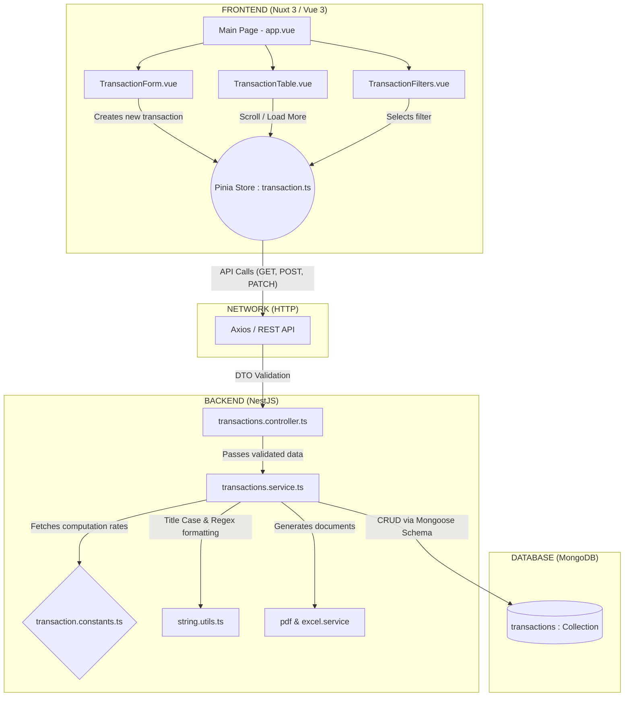

# Estate Finance - Transaction Management System

A robust, full-stack application designed for real estate agencies to manage property transactions, automate commission distributions, and track financial workflows from initial agreement to completion.

## 🚀 Quick Start

### Prerequisites
- [Node.js (LTS)](https://nodejs.org/)
- [MongoDB (Local or Atlas)](https://www.mongodb.com/)

### 1. Backend Setup (NestJS)

The backend operates on **NestJS** and **MongoDB**.
```bash
cd backend
npm install
```

Create a `.env` file in the `backend` folder:
```env
MONGODB_URI=your_mongodb_connection_string
PORT=3000
```

Start the backend development server:
```bash
npm run start:dev
```
- **API Documentation (Swagger):** [http://localhost:3000/api/docs](http://localhost:3000/api/docs)

### 2. Frontend Setup (Nuxt 3)

The frontend is a modern dashboard built with **Nuxt 3**.
```bash
cd frontend
npm install
```

Start the frontend development server:
```bash
npm run dev
```
- **Dashboard Application:** [http://localhost:3001](http://localhost:3001)

---

## 🛠 Tech Stack

### Backend
- **Framework:** NestJS (`@nestjs/core`, `@nestjs/common`)
- **Database:** MongoDB & Mongoose (`@nestjs/mongoose`)
- **Validation:** `class-validator`, `class-transformer`
- **Documentation:** Swagger (`@nestjs/swagger`)
- **File Generators:** ExcelJS (`exceljs`), PDFKit (`pdfkit`)

### Frontend
- **Framework:** Nuxt 3 / Vue 3
- **State Management:** Pinia (`@pinia/nuxt`)
- **Styling:** Tailwind CSS (`@nuxtjs/tailwindcss`)
- **HTTP Client:** Axios

---

## 🏗 System Architecture Flow

The following diagram illustrates the interaction between system components, from the Nuxt 3 frontend to the NestJS backend and MongoDB layer.


> **Note:** For an in-depth explanation of the architectural decisions and business logic rules shown above, please refer to the [DESIGN.md](./DESIGN.md) file.

---


## 📖 Key Features

- **Automated Commission Distribution:** Implements strict business rules splitting commissions (50% Agency / 50% Agents) via a centralized `CommissionPolicy` Single Source of Truth. Supports multiple agent splits seamlessly and stores historic snapshots.
- **Transaction Lifecycle & Immutability:** Dedicated phases: `Agreement` ➔ `Earnest Money` ➔ `Title Deed` ➔ `Completed`. Strict lock mechanisms prevent modifications to completed records to ensure 100% audit traceability.
- **Smart Data Normalization & Autocomplete:** Newly created records undergo automatic Title Case normalization (with specific Turkish locale protections). The frontend automatically populates native dropdowns via unique agents scanned from the database footprint.
- **Native Partial & Case-Insensitive Search:** Replaces rigid Mongoose `$text` indices with dynamic, Turkish-character-aware `$regex` operations allowing partial matching (e.g. searching "ihsa" yields "İhsan").
- **Backend-Driven Global Sorting:** All paginated data is structurally sorted by the database layer guaranteeing true temporal accuracy over 1000s of rows, eliminating client-side memory sorting limitations.
- **Dynamic Configuration:** Built-in Nuxt 3 RuntimeConfig to allow seamless migrations between local and production API URLs without changing code.
- **Modern User Exchange:** Smooth infinite scroll functionality replacing traditional pagination, synced accurately with Backend counts.
- **Exporting Capabilities:** Generates detailed Excel exports and automated PDF settlement reports for accounting purposes utilizing snapshot calculations.

---

## 🏗 Architecture & Design Decisions

The application utilizes a decoupled **Client-Server Architecture**. Detailed structural insights and architectural philosophy can be found in the [DESIGN.md](./DESIGN.md) document. 

Key patterns include:
- **Embedded Financial Breakdown:** Commission records are embedded within transaction records to preserve audit trails against potential future policy changes.
- **Typesafe Operations:** Shared TypeScript interfaces enforce consistency and minimize runtime errors between the client and server.
- **Global Error Handling & Validation:** Robust pipes and exception filters in NestJS provide predictable client-facing error outputs.

---

## 🧪 Testing

The backend comes pre-configured with a robust **Jest** testing environment covering core business logic (e.g., commission rules) and lifecycle transition protections.

```bash
cd backend
npm run test           # Run standard unit tests
npm run test:watch     # Run unit tests in watch mode
npm run test:cov       # Generate test coverage report
npm run test:e2e       # Run end-to-end tests
```

---

## 📁 Repository Structure

```text
estate-finance/
├── backend/                # NestJS application
│   ├── src/                # Core business logic, controllers, services
│   ├── test/               # E2E and Unit test configurations
│   ├── package.json        # Backend dependencies & scripts
│   └── nest-cli.json       # Nest CLI settings
├── frontend/               # Nuxt 3 application
│   ├── app.vue             # Root component
│   ├── components/         # Reusable Vue components
│   ├── pages/              # Application routing & views
│   ├── stores/             # Pinia state management modules
│   ├── utils/              # Shared utility functions
│   └── package.json        # Frontend dependencies & scripts
├── DESIGN.md               # In-depth architectural breakdown
└── README.md               # Project documentation (this file)
```
